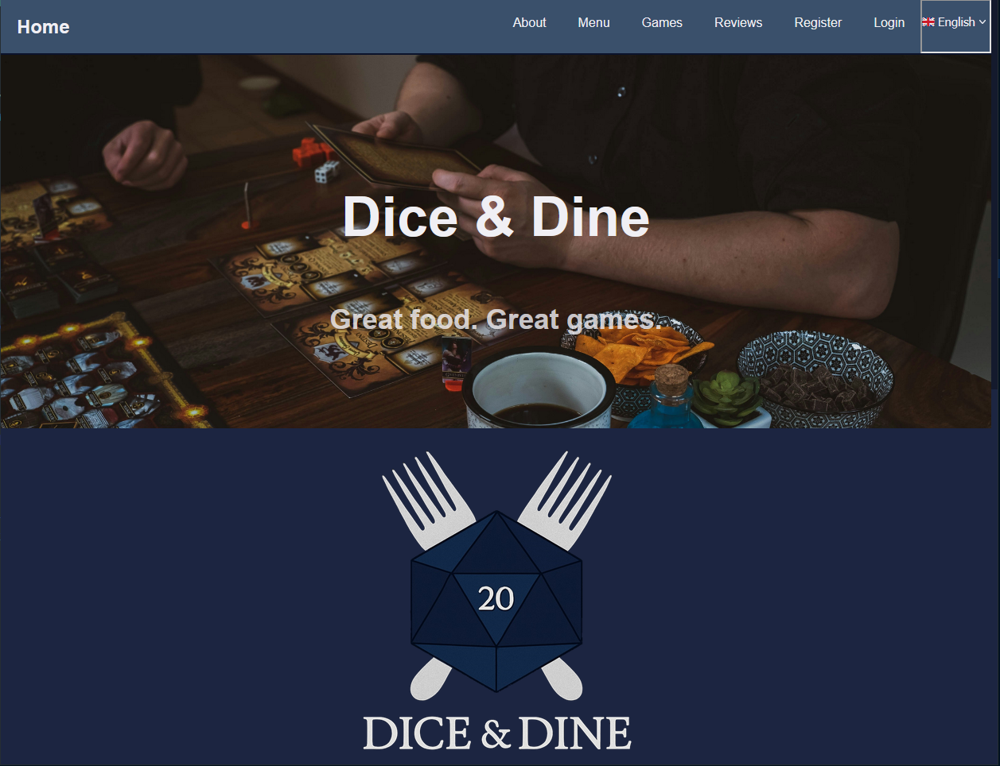
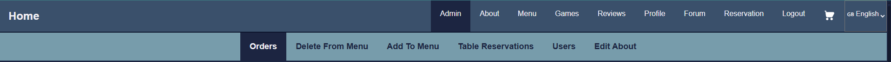

A React App built for a fictional restaurant where great food meets great board games. Developers are Leevi Rinnetmäki, Nea Lukumies, Aaro Jylhämäki and Juhana Hänninen.

## Table of Contents

- [Overview](#overview)
- [Features](#features)
- [Live app](#-live-app)
- [Running locally](#%EF%B8%8F-how-to-run-locally)
- [Testing the app](#-testing-the-app)
- [Testing the admin panel](#%EF%B8%8F-testing-the-admin-panel)
- [Backend repository](#-backend-repository)
- [Attributions](#attributions)

## Overview

Dice & Dine is the digital front door to a board game-themed restaurant. Customers can:

- Browse the food and drink menu
- Reserve tables in advance
- Explore a curated board game collection
- Place online orders
- Post in community forums
- Leave reviews and feedback

Designed to enhance both in-person and online experiences, Dice & Dine makes it effortless for guests to plan a visit, engage with the restaurant community, and share their gaming and dining adventures.

## Features

Dice & Dine offers a range of features to enhance the customer experience, from planning a visit to joining the community:

### 🧾 Menu & Ordering

- Browse a categorized menu: Starters, Mains, Desserts, and Beverages
- Add items to a shopping cart with live updates
- Place orders online for dine-in or pickup

### 📅 Table Reservations

- Book tables in advance by selecting date, time, duration, and preferred tables
- Add special instructions before confirming the reservation
- View upcoming reservations in your profile
- (Note: Cancellations must be done by phone)

### 🎲 Game Library

- Explore a curated selection of board games
- Filter games by category
- View summaries and key information at a glance

### 👤 Profile Management

- Create and update your personal profile
- Edit name, email, password, and profile picture
- Access order history and reservations from your profile dashboard

### ⭐ Reviews

- Leave a star-rated review (1–5) with a short comment (up to 150 characters)
- Submit feedback as a guest or logged-in user

### 💬 Forum

- Start new discussion threads or join ongoing conversations
- Each thread has a dedicated page for replies and discussions

### 🗺️ Embedded Map

- Interactive map on the homepage and contact page
- Highlights restaurant location, nearby bus stops, and public scooter stations

## 🚀 Live App



### ⚠️ Before You Begin

1. Connect to the Metropolia network via campus Wi-Fi or [VPN](https://wiki.metropolia.fi/display/tietohallinto/VPN-yhteys+GlobalProtect-palvelun+kautta).
2. Visit the [server](https://10.120.32.62).
3. In **Chrome**: Type `thisisunsafe` on your keyboard to bypass the warning screen.
   In **Firefox**: Click **Advanced**, then choose **Accept the Risk and Continue**.

> This step is required to connect to the server. If skipped, the app will not function properly.

---

### 🔗 Launch the App

Click below to open the React app:

👉 [Dice & Dine](https://users.metropolia.fi/~juhanaha/dice-and-dine/)

## 🛠️ How to Run Locally

This guide walks you through setting up the frontend for local development.

> **Note:** The backend is hosted externally and is not publicly available.
> You must first complete the steps in the [Live App](#-live-app) section to bypass the browser warning and connect to the backend.

---

### 🔧 Setup Instructions

1. **Clone the repository**
   ```bash
   git clone https://github.com/your-username/dice-and-dine.git
   cd dice-and-dine
   ```
2. **Create a `.env` file**
   Copy from `.env.example` and set your environment variables:
   ```bash
   VITE_API_URL=https://not-yet-hosted-backend.com
   ```
3. Install dependencies
   ```bash
   npm install
   ```
4. Start the development server
   ```bash
   npm run dev
   ```
5. **Open the app**
   Visit `http://localhost:5173` in your browser.

## 🧪 Testing the App

Follow the steps below to test each key feature and ensure the app is working as expected.
All pages can be accessed from the header menu.

Users without admin credentials will not see / access the admin panel.

### 0. Set Up a User Profile

- When first landing on the site, click **Register** to create a test user.
- A user profile is required to access most features (ordering, reservations, posting, etc.).
- Register a new profile with a unique username, email and password.
- After registration, log in with the new credentials.
  > **Note:** The page may not always refresh properly after registration. If you encounter issues, try refreshing the page manually.

### 1. Menu & Ordering

- Navigate to the Menu page.
- Add food items to the cart by clicking the [**+**] buttons.
- Confirm the cart icon appears in the header.
- Click the cart icon to view the order summary.
- Adjust item quantities and remove items as needed.
- Submit an order and verify it appears under your profile.

### 2. Table Reservations

- Go to the Reservations page.
- Select a date, time, duration, and table.
- Add a note in the extra info field and submit.
- Check that the reservation appears in your profile.

### 3. Game Library

- Browse the Games page.
- Use filters to narrow down game categories.
- Verify that game cards show relevant details.
  > **Note:** it is not possible to reserve games on the website.

### 4. Profile Management

- Sign up or log in with a test account.
- Edit profile details (name, email, password).
- Change profile picture.
- Confirm reservation and order history are visible.

### 5. Reviews

- Submit a review as a guest and as a logged-in user.
- Use different star ratings and verify character limit enforcement.
- Check that reviews appear after submission.
  > **Note:** The review form may not always refresh properly after submission. If you encounter issues, try refreshing the page manually.

### 6. Forum

- Create a new thread.
- Reply to an existing thread.
- Verify that thread pages display replies correctly.

### 7. Embedded Map

- Visit the homepage and Contact page.
- Confirm the map loads and shows correct location and nearby transport.

> Tip: Test on both desktop and mobile viewports to verify responsiveness.

## 🛠️ Testing the admin panel

To test admin-only functionality, log in using an account with admin credentials.
This section covers features such as user management, access controls, and other restricted tools available through the admin interface.
Make sure to verify that non-admin users cannot access these areas.

The different pages of the admin panel are accessible from the special admin header menu.

### 0. Logging in as an admin

- Use the credentials below to log in as an admin:
  - **Username:** admin
  - **Password:** admin
- Once logged in, the **Admin Panel** will appear in the navigation menu.

### 1. Order management

- Go to the **Orders** page in the admin panel.
- View the list of all user-submitted orders.
- Filter orders by status or date to test filtering functionality.
- Update an order’s status (e.g., from “Pending” to “Completed”) and confirm it saves.
  > **Note:** It is currently not possible to edit orders in the admin panel.

### 2. Menu management

- Go to the **Add To Menu** page in the admin panel.
- Add a new item by filling in all required fields (name, description, price).
- Ensure both **English** and **Finnish** fields are completed.
- Confirm the item appears correctly in the user-facing menu.
- Then, go to **Delete From Menu**.
- Remove the item you just added.
- Verify that the item is no longer visible in the menu.
  > **Note:** It is currently not possible to edit menu items from the admin panel.

### 3. Table reservations management

- Go to the **Table Reservations** page in the admin panel.
- View the list of all reservations made by users.
- Test filtering by date to check functionality.
  > **Note:** It is currently not possible to edit/delete reservations from the admin panel.

### 4. User management

- Go to the **Users** page in the admin panel.
- View the list of all registered users.
  > **Note:** It is currently not possible to edit/delete users from the admin panel.

### 5. Restaurant information management

- Go to the **Edit About** in the admin panel.
- Click the ✏️ icon to modify the restaurant’s name, description, etc.
- Confirm that updates appear correctly on the **Home** and **About** pages.
  > **Note:** It is currently not possible to edit the restaurant's location from the admin panel.

## 🧪 Testing

The app includes automated tests to ensure key features work as expected. These tests cover core user
flows such as logging in, navigating the menu, and accessing admin-only pages.

To run the test suite:

```bash
npx playwright test

```

## 💻 Backend Repository

Find the backend repository here: 👉 [Dice & Dine Backend](https://github.com/Aarojy/dice-and-dine-backend)

Apidocs: 👉 [Dice & Dine Apidocs](https://users.metropolia.fi/~aarojy/root/project-apidocs/)

## Attributions

- Hero image from [Unsplash](https://unsplash.com/photos/a-man-sitting-at-a-table-playing-a-board-game-7gagNAbWocg?utm_content=creditShareLink&utm_medium=referral&utm_source=unsplash)

```

```
